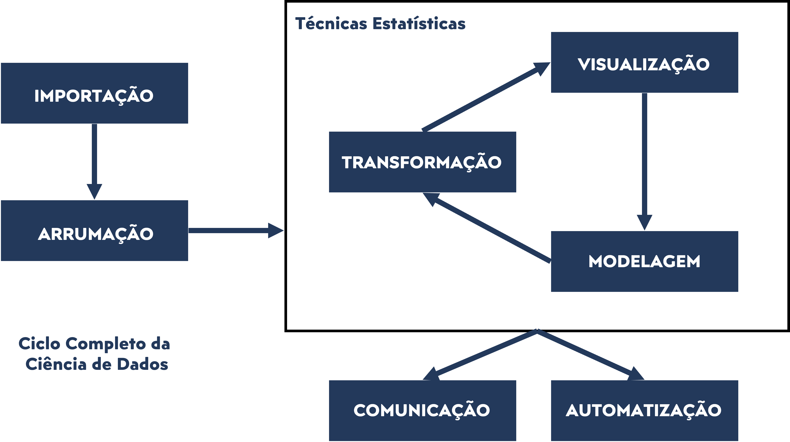
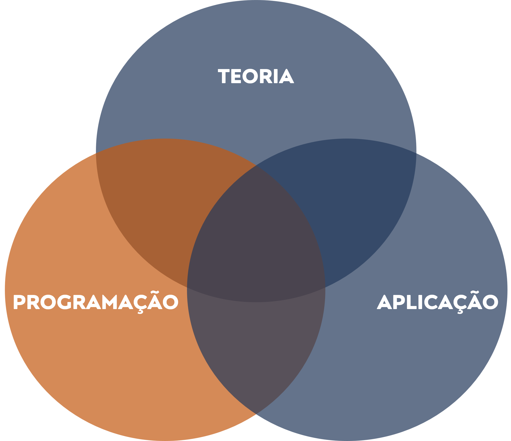

```{r ,echo=FALSE}

xaringanExtra::use_scribble()

xaringanExtra::use_search(show_icon = TRUE)

```

## APRESENTAÇÃO

- [**QUAL O OBJETIVO DA AULA**](#objetivo_aula)

- [**O QUE É ESSE TAL DE R?**](#sobre_r)

- [**VAMOS INICIAR NOSSO DICIONÁRIO?**](#dicionario_r)

- **PRIMEIROS PASSOS NO R**


---
class: inverse, center, middle 
name: objetivo_aula

# QUAL O OBJETIVO DA AULA?

```{r, echo = F, fig.align = 'center', fig.alt= 'Gif da série the office para apresentar o professor', out.width = '50%'}
knitr::include_graphics('https://media.giphy.com/media/BpGWitbFZflfSUYuZ9/giphy.gif')
```

---
<div style="text-align: justify">
## OBJETIVO DA AULA

Esta aula tem por objetivo principal **apresentar a principal ferramenta da 
disciplina para aplicação dos conceitos a serem trabalhados a frente: a linguagem 
de programação R**.


De um lado, não é esperado que você tenha qualquer conhecimento prévio. Iniciaremos
realmente "do zero", isto é, desde a fase de configuração inicial. Por outro lado, é esperado que ao final da aula toda a nossa estação de trabalho esteja pronta para uso e, 
mais que isso, que não tenhamos medo de usá-la.


---
<div style="text-align: justify">
## OBJETIVO DA AULA

Não vamos esquecer que será a **linguagem de programação R** que nos permitirá 
realizar **todas as etapas da ciência de dados em um único software**. Assim, o
início do estudo em R pode parecer complicado, mas o resultado é muito importante
para a vida profissional e acadêmica. 

</br>
Vamos lembrar do ciclo da ciência de dados?

---
<div style="text-align: justify">

## CICLO DA CIÊNCIA DE DADOS

```{r, echo = F, fig.align = 'center', out.width = '75%'}

```

---
<div style="text-align: justify">
## NOSSO FOCO COM O OBJETIVO DA AULA

```{r, echo = F, fig.align = 'center', out.width = '50%'}

```

---
class: inverse, center, middle 
name: sobre_r

# O QUE É ESSE TAL DE R?

```{r, echo = F, fig.align = 'center', fig.alt= 'Gif da série the office para apresentar o professor', out.width = '50%'}
knitr::include_graphics('https://media.giphy.com/media/AEkhbYZRKUaVoEDKph/giphy.gif')
```

---
<div style="text-align: justify">

## O TAL DO R

O **R** é um software livre (*open source*) que foi criado na década de 1990 por 
dois estatísticos da Universidade de Auckland (Nova Zelândia), **R**oss Ihaka e 
**R**obert Gentleman (isso mesmo, o nome do software se refere as iniciais dos
nomes de seus desenvolvedores).


Ele foi criado por dois estatísticos e para aplicações estatísticas (por isso a
escolha do mesmo para esta disciplina). Atualmente, a Foudation for Statistical 
Computing dá suporte ao software e ele ganhou uma ampla gama de aplicações e 
funcionalidades se tornando um dos programas mais utilizados em todo o mundo!

---
<div style="text-align: justify">
## O TAL DO R

Como visto na aula anterior, programar em R significa organizar um **algoritmo que seja interpretável pelo software** (na programação, dizemos: **desenvolver um algoritmo a ser compilado pelo software R**). Neste sentido, é interessante desenvolver um pouco melhor este
conceito.

**DEFINIÇÃO DE ALGORITMO:**
- Conjunto das regras e procedimentos lógicos perfeitamente 
definidos que levam à solução de um problema em um número finito de etapas.


---
<div style="text-align: justify">
## AFINAL, O QUE SIGNIFICA PROGRAMAR EM R?

**COMPILAR EM R:**
- Tradução (ou **interpretação**) de um determinado código escrito 
(**algoritmo**) em linguagem de máquina para a execução das tarefas definidas.


---
<div style="text-align: justify">
## PRECISAMOS SER ORGANIZADOS, SEMPRE!

Como visto, um algoritmo é uma sequência de etapas escritas em um código e com 
alguma finalidade específica. Mas essa singela definição pode deixar passar um 
fato importante: **O código pode ser muito grande, com muitos "atributos"!**


Assim, o seu desenvolvimento pode se tornar complexo em alguns casos e, mais que 
isso, o seu entedimento no futuro (quando for retomado por você ou mesmo por outros pesquisadores) também pode ser complicado.


---
<div style="text-align: justify">
## PRECISAMOS SER ORGANIZADOS, SEMPRE!

Para nos ajudar nessa tarefa de organizar os algoritmos desenvolvidos, ou em 
desenvolvimento, utilizamos um outro aplicativo denominado: **RStudio**. Vale 
ressaltar, isso significa que **continuamos programando em linguagem R**, mas com a 
ajuda de um organizador chamado **RStudio** (em programação, esse "organizador"
é chamado de **IDE -  Integrated Development Enviroment**).

---
## A CARA DA CIÊNCIA DE DADOS!

.pull-left[
**R ("linguagem")**

<br/>

```{r, echo = F, fig.align = 'center', out.width = '100%'}
knitr::include_graphics('foto_r.png')
```
]

.pull-right[
**RStudio ("organizador")**

<br/>

```{r, echo = F, fig.align = 'center', out.width = '80%'}
knitr::include_graphics('foto_rstudio.jpg')
```
]


---
class: inverse, center, middle 
name: dicionario_r

# VAMOS INICIAR O NOSSO DICIONÁRIO?

```{r, echo = F, fig.align = 'center', fig.alt= 'Gif da série the office para apresentar o professor', out.width = '50%'}
knitr::include_graphics('https://media.giphy.com/media/9psHrHyIXciY6lCz8B/giphy.gif')
```

---
<div style="text-align: justify">

## CONCEITOS INICIAIS

- **OPERAÇÃO:** Similar ao conceito da matemática (soma "+", subtração "-", 
multiplicação "*", divisão "/", potenciação "**" e etc.).

<br/>

- **OBJETO:** Qualquer coisa (número, conjunto de números, imagens, etc.) que 
pode ser associada (armazenada) em uma variável. Para criar um objeto no R (ou 
associar determinada informação à um objeto) utiliza-se o sinal de atribuição 
"<-" (como se fosse uma seta que mostra o que está sendo atribuído ao objeto).


---
<div style="text-align: justify">

## CONCEITOS INICIAIS

- **FUNÇÃO:** Ação (ou conjunto de ações) pré-definidas a serem implementadas de 
modo a gerar um *output* a partir de algum *input* a ser fornecido. Os inputs
fornecidos para uma função são chamados de **Argumentos**.

<br/>

- **PACOTES:** Bibliotecas contendo funções com finalidades específicas (em 
alguns casos, contendo dados de exemplo também).


---
## ENTENDENDO A EXISTÊNCIA DE PACOTES

.pull-left[
**Pacote 1 (Finalidade: furar parede)**


```{r, echo = F, fig.align = 'center', out.width = '100%'}
knitr::include_graphics('foto_furadeira.jpg')
```
]

.pull-right[
**Pacote 2 ("Finalidade: Apertar porcas")**


```{r, echo = F, fig.align = 'center', out.width = '100%'}
knitr::include_graphics('foto_chaverosca.jpg')
```
]

---
## COMO INSTALAR E USAR PACOTES?

.pull-left[

**NO CONSOLE**

**install.packages("nome_do_pacote")**

```{r, echo = F, fig.align = 'center', out.width = '100%'}
knitr::include_graphics('foto_instalando.jpg')
```
]

.pull-right[

**NO SCRIPT**

**nome_do_pacote::nome_da_função**


```{r, echo = F, fig.align = 'center', out.width = '100%'}
knitr::include_graphics('foto_ascendendo.jpg')
```
]

---
class: inverse, center, middle


```{r, echo = F, fig.align = 'center', fig.alt= 'Gif para agradecer pela atenção e o tema é da série the office', out.width = '80%'}

knitr::include_graphics('https://media.giphy.com/media/n4oKYFlAcv2AU/giphy.gif')

```

