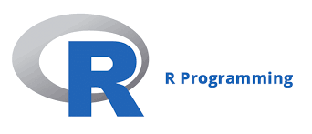
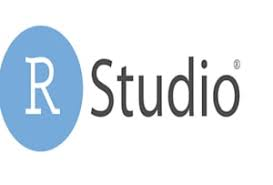

```{r ,echo=FALSE}

xaringanExtra::use_scribble()

xaringanExtra::use_search(show_icon = TRUE)

```

## APRESENTAÇÃO

- [**QUAL O OBJETIVO DA AULA**](#objetivo_aula)

- [**O QUE É ESSE TAL DE R?**](#sobre_r)

- [**QUAIS OS PRINCIPAIS CONCEITOS DE R?**](#dicionario_r)

- [**CONHECENDO O RSTUDIO**](#rstudio)

- **PRIMEIROS PASSOS - ORGANIZANDO A ESTAÇÃO DE TRABALHO**


---
class: inverse, center, middle 
name: objetivo_aula

# QUAL O OBJETIVO DA AULA?

```{r, echo = F, fig.align = 'center', fig.alt= 'Gif da série the office para apresentar o professor', out.width = '50%'}
knitr::include_graphics('https://media.giphy.com/media/BpGWitbFZflfSUYuZ9/giphy.gif')
```

---
<div style="text-align: justify">
## OBJETIVO DA AULA

Esta aula tem por objetivo principal **apresentar a principal ferramenta da 
disciplina para aplicação dos conceitos a serem trabalhados a frente: a linguagem 
de programação R**.


De um lado, não é esperado que você tenha qualquer conhecimento prévio. Iniciaremos
realmente "do zero", isto é, desde a fase de configuração inicial. Por outro lado, 
é esperado que ao final da aula toda a nossa estação de trabalho esteja pronta para 
uso e, mais que isso, que não tenhamos medo de usá-la.


---
<div style="text-align: justify">
## OBJETIVO DA AULA

Não vamos esquecer que será a **linguagem de programação R** que nos permitirá 
realizar **todas as etapas da ciência de dados em um único software**. Assim, o
início do estudo em R pode parecer complicado, mas o resultado é muito importante
para a vida profissional e acadêmica. 

</br>
Vamos lembrar do ciclo da ciência de dados?

---
<div style="text-align: justify">

## CICLO DA CIÊNCIA DE DADOS

```{r, echo = F, fig.align = 'center', out.width = '75%'}
knitr::include_graphics('ciclo_ciencia_dados.png')
```

---
<div style="text-align: justify">
## NOSSO FOCO COM O OBJETIVO DA AULA

```{r, echo = F, fig.align = 'center', out.width = '50%'}
knitr::include_graphics('foco_prog.png')
```

---
class: inverse, center, middle 
name: sobre_r

# O QUE É ESSE TAL DE R?

```{r, echo = F, fig.align = 'center', fig.alt= 'Gif da série the office para apresentar o professor', out.width = '50%'}
knitr::include_graphics('https://media.giphy.com/media/AEkhbYZRKUaVoEDKph/giphy.gif')
```

---
<div style="text-align: justify">

## O TAL DO R

O **R é um software livre** (*open source*) que foi criado na década de 1990 por 
dois estatísticos da Universidade de Auckland (Nova Zelândia), **Ross Ihaka** e 
**Robert Gentleman** (isso mesmo, o nome do software se refere as iniciais dos
nomes de seus desenvolvedores).


Ele foi criado por dois estatísticos e para aplicações estatísticas (por isso a
escolha do mesmo para esta disciplina). Atualmente, a **R Foudation for Statistical 
Computing** dá suporte ao software e ele ganhou uma ampla gama de aplicações e 
funcionalidades se tornando um dos programas mais utilizados em todo o mundo!

---
<div style="text-align: justify">

## O TAL DO R

O fato de possuir como mantenedora uma fundação para estatística computacional 
é uma das principais vantagens de utilização do software R. Assim, pode-se garantir
que as aplicações são validadas cientificamente. 

</br>

Mas afinal de contas, o que é programar na linguagem R?

---
<div style="text-align: justify">

## DEFINIÇÃO DE PROGRAMAÇÃO NA LINGUAGEM R

Programar na linguagem R significa organizar um **algoritmo que 
seja interpretável pelo software** (na programação, dizemos: **desenvolver um 
algoritmo a ser compilado pelo software R**). Neste sentido, é interessante 
desenvolver um pouco melhor este conceito.

---
<div style="text-align: justify">

## DEFINIÇÃO DE PROGRAMAÇÃO NA LINGUAGEM R

**DEFINIÇÃO DE ALGORITMO:**
- Conjunto de regras e procedimentos lógicos perfeitamente 
definidos que levam à solução de um problema em um número finito de etapas.

**COMPILAR EM R:**
- Tradução (ou **interpretação**) de um determinado código escrito 
(**algoritmo**) em linguagem de máquina para a execução das tarefas definidas.

---
<div style="text-align: justify">
## PRECISAMOS SER ORGANIZADOS!

Como visto, um algoritmo é uma sequência de etapas escritas em um código e com 
alguma finalidade específica. Mas essa singela definição pode deixar passar um 
fato importante: **O código pode ser muito grande, com muitos "atributos"!**

Assim, o seu desenvolvimento pode se tornar complexo em alguns casos e, mais que 
isso, o seu entedimento no futuro (quando for retomado por você ou mesmo por outros pesquisadores) também pode ser complicado.

---
<div style="text-align: justify">
## PRECISAMOS SER ORGANIZADOS, SEMPRE!

Para nos ajudar nessa tarefa de organizar os algoritmos desenvolvidos, ou em 
desenvolvimento, utilizamos um outro software denominado: **RStudio**. 

</br>

Vale ressaltar, isso significa que **continuamos programando em linguagem R**, 
mas com a ajuda de um organizador de algoritmo chamado **RStudio** (em programação, 
esse "organizador" é chamado de **IDE -  Integrated Development Enviroment**).

---
## A CARA DA CIÊNCIA DE DADOS!

.pull-left[
**R ("linguagem")**

<br/>

```{r, echo = F, fig.align = 'center', out.width = '100%'}

```
]

.pull-right[
**RStudio ("organizador")**

<br/>

```{r, echo = F, fig.align = 'center', out.width = '80%'}

```
]


---
class: inverse, center, middle 
name: dicionario_r

# QUAIS OS PRINCIPAIS CONCEITOS DE R?

```{r, echo = F, fig.align = 'center', fig.alt= 'Gif da série the office para apresentar o professor', out.width = '50%'}
knitr::include_graphics('https://media.giphy.com/media/9psHrHyIXciY6lCz8B/giphy.gif')
```

---
<div style="text-align: justify">

## CONCEITOS INICIAIS

- **FUNÇÃO:** Um código que determina a **realização de uma tarefa específica**. Em
geral, as funções aceitam **entradas** (**argumentos** da função) para produzirem uma 
determinada **saída**. 

  - **Funções matemáticas**: soma **"+"**, diferença **"-"**, divisão **"/"**, 
  multiplicação **"*"**);
  
  - **Funções estatísticas**;
  
  - **Funções de manipulação de dados**.

---
<div style="text-align: justify">

## CONCEITOS INICIAIS

- **OBJETO:** Uma estrutura que armazena dados (número, conjunto de números, 
imagens, texto, etc.). Para criar um objeto no R (ou seja, armazenar determinada 
informação em um objeto) utiliza-se o sinal de atribuição "**<-**" (como se fosse 
uma seta que mostra o dado que está sendo armazenado ao objeto). Os principais
tipos de objetos são:

  - **Vetores**: Um vetor é uma sequência de elementos do mesmo tipo. Pode ser 
  um vetor numérico, de caracteres, lógico, entre outros.
  
  - **Matrizes**: Matrizes são vetores bidimensionais com elementos do mesmo tipo;

---
<div style="text-align: justify">

## CONCEITOS INICIAIS

- **OBJETO:** Uma estrutura que armazena dados (número, conjunto de números, 
imagens, texto, etc.). Para criar um objeto no R (ou seja, armazenar determinada 
informação em um objeto) utiliza-se o sinal de atribuição "**<-**" (como se fosse 
uma seta que mostra o dado que está sendo armazenado ao objeto). Os principais
tipos de objetos são:
    
  - **Data Frame**: estruturas semelhantes a tabelas, onde as colunas podem ser 
  de diferentes tipos. Eles são usados para armazenar conjuntos de dados tabulares;
  
  - **Lista**: coleções ordenadas de objetos, que podem ser de tipos diferentes.


---
<div style="text-align: justify">

## CONCEITOS INICIAIS

- **PACOTES:** Conjunto de funções (ou conjuntos de dados) com documentação 
relacionada e que se destinam a realizar tarefas específicas.

- Existem milhares de pacotes disponíveis na comunidade R que cobrem uma ampla 
gama de tarefas, desde análise de dados até criação de gráficos. Para usar as 
funções de um pacote, você precisa instalá-lo e carregá-lo em sua sessão R.

---
## ENTENDENDO A EXISTÊNCIA DE PACOTES

.pull-left[
**Pacote 1 (Finalidade: furar parede)**


```{r, echo = F, fig.align = 'center', out.width = '100%'}

```
]

.pull-right[
**Pacote 2 ("Finalidade: Apertar porcas")**


```{r, echo = F, fig.align = 'center', out.width = '100%'}
knitr::include_graphics('foto_chaverosca.jpg')
```
]

---
<div style="text-align: justify">

## CONCEITOS COMPLEMENTARES

A linguagem R é principalmente uma **linguagem de programação orientada a funções**. 
Isto é, o R permite a criação e manipulação de objetos (dados armazenados), por
meio da execução de funções.

Esta é uma das grandes diferenças entre o R e o python (linguagem orientada à 
objeto).


---
class: inverse, center, middle 
name: rstudio

# CONHECENDO O RSTUDIO

```{r, echo = F, fig.align = 'center', fig.alt= 'Gif da série the office para apresentar o professor', out.width = '50%'}
knitr::include_graphics('https://media.giphy.com/media/myeDS6IoQrnyqus91Q/giphy.gif')
```

---
<div style="text-align: justify">

## CONHECENDO O RSTUDIO

- O **RStudio** possui uma interface dividida em quatro quadrantes, cada um 
desempenhando um papel específico:

  - **Script** (Quadrante Superior Esquerdo);
  - **Console** (Quadrante Inferior Esquerdo);
  - **Ambiente** (Quadrante Superior Direito);
  - **Arquivos/Gráficos/Pacotes/Ajuda** (Quadrante Inferior Direito).

---
<div style="text-align: justify">

## CONHECENDO O RSTUDIO

**Script** (Quadrante Superior Esquerdo): Neste quadrante, você pode criar, 
editar, executar e salvar o algoritmo desenvolvido na linguagem R. 

Isso permite que você escreva um conjunto de instruções R de forma sequencial e, 
em seguida, execute todas as instruções de uma vez. Isso é útil para criar fluxos 
de trabalho complexos ou análises repetíveis.

---
<div style="text-align: justify">

## CONHECENDO O RSTUDIO

**Console** (Quadrante Inferior Esquerdo): O console é onde você interage 
diretamente com o R. Você pode digitar comandos R diretamente no console e ver 
os resultados imediatamente. É um ótimo lugar para testar pequenos trechos de 
código, experimentar funções e verificar resultados.

De fato, a integração entre IDE RStudio e o software R ocorre no console. 

---
<div style="text-align: justify">

## CONHECENDO O RSTUDIO
**Ambiente** (Quadrante Superior Direito): Este quadrante exibe informações 
sobre os objetos que você criou e suas propriedades. 

Quando você define variáveis ou carrega dados no R, esses objetos são listados 
no ambiente. Isso permite que você acompanhe as variáveis e objetos que estão 
disponíveis para uso em sua sessão R.

---
<div style="text-align: justify">

## CONHECENDO O RSTUDIO

**Arquivos/Gráficos/Pacotes/Ajuda** (Quadrante Inferior Direito): Neste painel, 
você pode explorar e navegar pelos arquivos e pastas do sistema de arquivos do 
seu computador. Ver os gráficos que são gerados a partir dos seus comandos de 
visualização. Ver informações sobre os pacotes (bibliotecas) que estão instalados 
no seu ambiente R. Acessar a documentação de ajuda para funções e pacotes do R.

---
## VOLTANDO, COMO INSTALAR E USAR PACOTES?

.pull-left[

**NO CONSOLE**

**install.packages("nome_do_pacote")**

```{r, echo = F, fig.align = 'center', out.width = '100%'}
knitr::include_graphics('foto_instalando.jpg')
```
]

.pull-right[

**NO SCRIPT**

**nome_do_pacote::nome_da_função**


```{r, echo = F, fig.align = 'center', out.width = '100%'}
knitr::include_graphics('foto_ascendendo.jpg')
```
]

---
class: inverse, center, middle


```{r, echo = F, fig.align = 'center', fig.alt= 'Gif para agradecer pela atenção e o tema é da série the office', out.width = '80%'}

knitr::include_graphics('https://media.giphy.com/media/n4oKYFlAcv2AU/giphy.gif')

```

